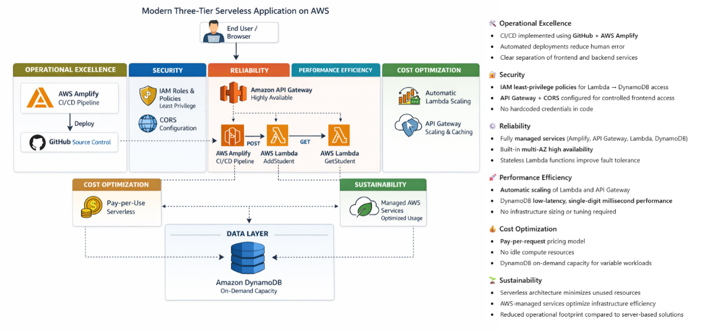

# ⭐ Modern Three-Tier Serverless Application on AWS

> **Technologies:** AWS Amplify · API Gateway · AWS Lambda · DynamoDB  
> **Architecture:** Serverless · Microservices · AWS Well-Architected Framework

---

## 📌 Overview

This project demonstrates the design and implementation of a **modern, serverless three-tier application on AWS** using **microservices architecture**.  
It leverages **AWS-managed services** to achieve **scalability, security, reliability, and rapid deployment** with minimal operational overhead.

---

## 🏗 Architecture Summary

**Frontend**
- HTML, CSS, JavaScript
- Hosted on **AWS Amplify**
- CI/CD integrated with GitHub

**Backend**
- AWS Lambda functions (Python 3.11)
- REST APIs via **Amazon API Gateway**

**Database**
- Amazon DynamoDB (on-demand, highly scalable)

**CI/CD**
- GitHub source control
- Automatic builds and deployments via AWS Amplify

---

## 🧭 AWS Well-Architected Pillars

| Pillar | Implementation |
|--------|----------------|
| Operational Excellence | CI/CD via GitHub + Amplify, separation of frontend/backend |
| Security | IAM least-privilege, CORS-enabled APIs |
| Reliability | Managed services, multi-AZ availability, stateless Lambda |
| Performance Efficiency | Auto-scaling Lambda & API Gateway, DynamoDB low latency |
| Cost Optimization | Pay-per-request serverless model, no idle compute |
| Sustainability | Reduced operational footprint with serverless architecture |

---

## 🧩 Key Features

- Add and retrieve student records using REST APIs  
- Stateless Lambda microservices  
- Secure DynamoDB access via IAM roles  
- Automated frontend deployments  
- Robust CORS and API integration handling  

---

## 🔧 Implementation Steps

1. **Frontend Deployment (AWS Amplify)**  
   - Connected GitHub repository  
   - Deployed static HTML/CSS/JS site  
   - Automatic CI/CD for code changes  

2. **DynamoDB Table**  
   - Table: `Student-Details`, Partition Key: `ID`  
   - On-demand capacity for scalable performance  

3. **Lambda Functions**  
   - `AddStudent` → POST request inserts data  
   - `GetStudent` → GET request retrieves data  
   - IAM policies applied for secure DynamoDB access  

4. **API Gateway**  
   - REST API: `/addStudent` (POST) & `/getStudent` (GET)  
   - Integrated with Lambda functions  
   - CORS configured for frontend  

5. **Frontend–Backend Integration**  
   - Updated API URLs in `app.js`  
   - Amplify auto-redeploys frontend on GitHub push  

---

## ✅ Results & Validation

- Added multiple student records via UI  
- Verified records in DynamoDB  
- GET API successfully retrieved records  
- Application fully functional with minimal operational overhead  

---

## 🧠 Skills Demonstrated

- Serverless architecture design on AWS  
- Microservices using Lambda & API Gateway  
- DynamoDB schema design & IAM security  
- CI/CD using GitHub + Amplify  
- Troubleshooting IAM & CORS issues  
- End-to-end full-stack cloud solution delivery  

---

## 🔮 Future Enhancements

- Add **Amazon Cognito authentication**  
- Input validation and error handling  
- Pagination for DynamoDB queries  
- Infrastructure as Code (Terraform/CDK)  
- Centralized logging & observability with CloudWatch  

---

## ⭐ Call to Action

If you find this project useful for learning **serverless architecture**, consider starring this repo! 🌟